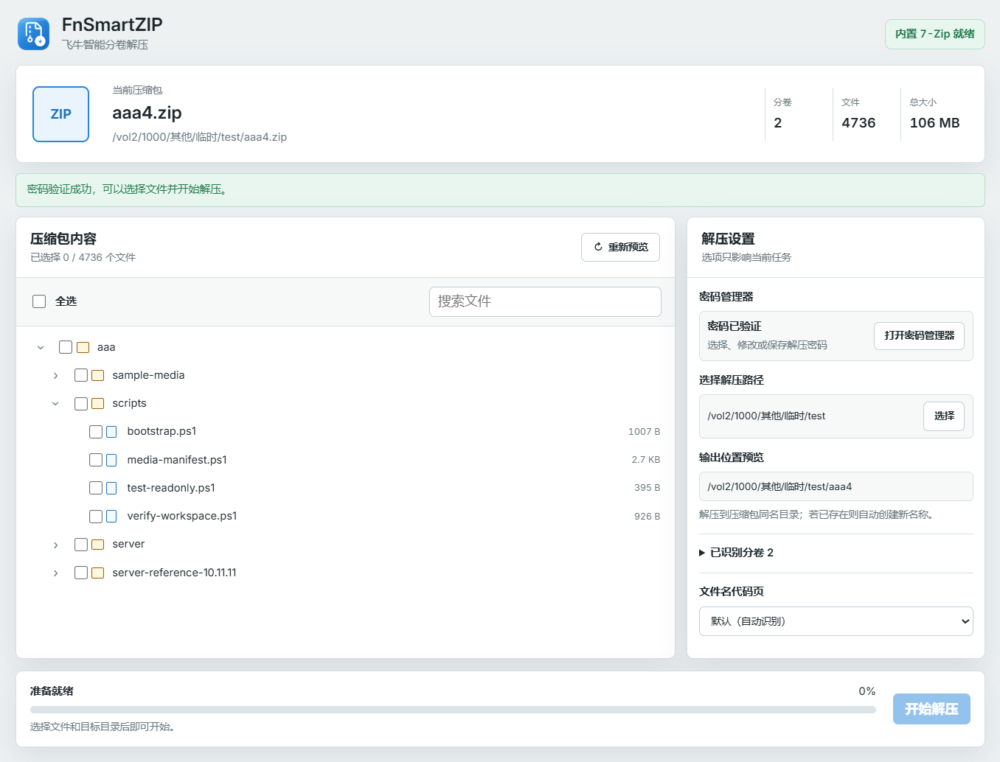
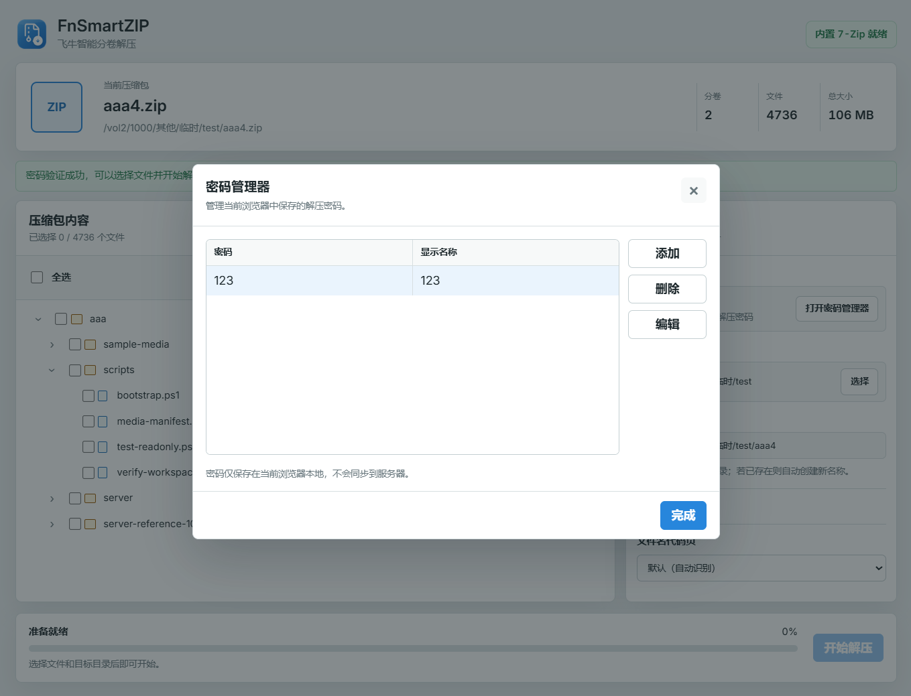

# FnSmartZIP 1.0.0 飞牛智能分卷解压

FnSmartZIP 是一款用于 fnOS的解压应用。安装后右键压缩包或分卷首卷，即可开始解压。

支持普通和分卷压缩包，并提供预览、选择性解压、解压路径选择、密码管理等功能。

## 应用截图

### 主界面

### 密码管理器

## 主要功能

### 文件预览与选择性解压

- 使用文件树显示压缩包中的文件和目录。
- 显示文件数量、总大小和加密状态。
- 支持搜索和解压指定文件。

### 密码与代码页

- 密码管理器支持添加、编辑、删除和快速选择密码。
- 支持自动识别、UTF-8、GBK、Big5、Shift-JIS 和韩文代码页。

## 支持格式

### 普通压缩包

`.7z`、`.zip`、`.rar`、`.tar`、`.tgz`、`.tbz`、`.tbz2`、`.txz`

### 单文件压缩与 TAR 包装

`.gz`、`.bz2`、`.xz`、`.zst`、`.zstd`、`.tar.gz`、`.tar.bz2`、
`.tar.xz`、`.tar.zst`、`.tzst`

### 其他格式

`.cab`、`.iso`、`.arj`、`.lzh`、`.lha`

### 分卷格式

- 7Z：`.7z.001`、`.7z.002`……
- ZIP 数字分卷：`.zip.001`、`.zip.002`……
- 通用数字分卷：`.001`、`.002`……
- ZIP 传统分卷：`.zip + .z01 + .z02`
- RAR 新式分卷：`.part1.rar`、`.part2.rar`
- RAR 旧式分卷：`.rar + .r00 + .r01`

## 首次使用

如果应用无法读取压缩包，请在 fnOS 文件管理器中设置权限：

1. 右键压缩包所在文件夹，选择“详细信息”。
2. 打开“权限”，依次选择“新增”→“应用”。
3. 添加 FnSmartZIP。
4. 源目录授予读取权限，目标目录授予读取和写入权限。
5. 保存后返回 FnSmartZIP 重新检测。

## 使用方法

1. 在文件管理器中找到压缩包或分卷首卷。
2. 右键选择“使用 FnSmartZIP 打开”。
3. 预览内容，按需勾选文件并选择解压路径。
4. 点击“开始解压”。

## 诊断与日志

“查看诊断”可以生成脱敏 JSON 报告。反馈问题时建议提供：

- FnSmartZIP、fnOS 版本和设备架构
- 压缩格式与分卷命名
- 页面错误分类和请求 ID
- 诊断 JSON
- 是否使用解压密码

## 致谢

FnSmartZIP 基于 xinZip 继续开发：

- [ff-xin/xinZip](https://github.com/ff-xin/xinZip)
- [飞牛论坛原帖](https://club.fnnas.com/forum.php?mod=viewthread&tid=64284&highlight=)

项目内置的 7-Zip 及其他第三方文件遵循各自的许可证。

## 开源许可证

本项目采用 [GNU General Public License v3.0](https://www.gnu.org/licenses/gpl-3.0.html) 开源。

您可以使用、修改和分发本项目。分发原始或修改后的版本时，需要继续采用 GPL-3.0 许可证、提供相应源代码，并保留版权和许可证声明。
